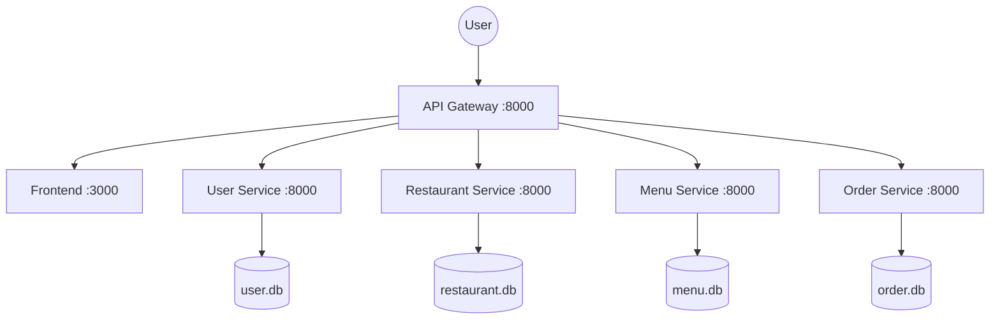

# FastBite Food Delivery Microservices

## Team Information

| Name                  | Student ID | Role | Contribution |
| --------------------- | ---------- | ---- | ------------ |
| Hồ Anh Dũng           | B22DCVT090 |      |              |
| Nguyễn Hoàng Phan Anh | B22DCCN028 |      |              |

## System Architecture



FastBite is a food delivery system built with a frontend SPA, an Nginx gateway, and four FastAPI microservices.

## Project Structure

```text
.
|-- README.md
|-- .env.example
|-- docker-compose.yml
|-- Makefile
|-- docs/
|   |-- analysis-and-design.md
|   |-- architecture.md
|   |-- api-specs/
|   `-- asset/
|-- frontend/
|-- gateway/
|-- scripts/
|-- services/
|   |-- user-service/
|   |-- restaurant-service/
|   |-- menu-service/
|   `-- order-service/
`-- .ai/
```

## Main Features

- Customer login, register, profile update, cart, checkout, and order tracking
- Separate manager login and manager dashboard
- User/account management through `user-service`
- Restaurant management through `restaurant-service`
- Menu management through `menu-service`
- Order lifecycle management through `order-service`
- Shared gateway entrypoint at `http://localhost:8000`

## Services

### Frontend

- Static SPA served by Nginx
- Customer routes:
  - `#/auth`
  - `#/profile`
  - `#/`
  - `#/cart`
  - `#/checkout`
  - `#/tracking`
- Manager route:
  - `#/manager-auth`
  - `#/manager`

### Gateway

- Public entrypoint on port `8000`
- Routes:
  - `/` -> frontend
  - `/users*` and `/api/users*` -> `user-service`
  - `/api/auth*` -> `user-service`
  - `/restaurants*` and `/api/restaurants*` -> `restaurant-service`
  - `/menus*` -> `menu-service`
  - `/orders*` and `/api/orders*` -> `order-service`
  - `/api/menu-items*` (legacy compatibility) -> `menu-service`
  - `/api/restaurants*` -> `restaurant-service`
  - `/health` -> gateway health response

### User Service

- `GET /health`
- `GET /users`
- `POST /auth/register`
- `POST /auth/login`

### Restaurant Service

- `GET /health`
- `GET /restaurants`
- `GET /restaurants/{restaurant_id}`
- `POST /restaurants`

### Menu Service

- `GET /health`
- `GET /menus`
- `GET /menus/{menu_item_id}`
- `POST /menus`
- `PATCH /menus/{menu_item_id}`
- `PATCH /menus/{menu_item_id}/availability`

### Order Service

- `GET /health`
- `POST /orders`
- `GET /orders`
- `GET /orders/{order_id}`
- `PATCH /orders/{order_id}/status`
- `DELETE /orders/{order_id}`

Order status flow:

- `PENDING -> CONFIRMED -> PREPARING -> DELIVERING -> DELIVERED`
- `CANCELLED` is allowed from `PENDING` or `CONFIRMED`

## Run

```bash
docker compose up --build
```

Open:

- App: `http://localhost:8000`
- Manager: `http://localhost:8000/#/manager-auth`

## Notes

- Frontend calls backend only through `/api/*` on the gateway.
- User, restaurant, menu, and order data are persisted in dedicated Docker volumes.
- `restaurant-service` seeds default restaurant data on startup.
- `menu-service` seeds default menu catalog data on startup.

## Submission Checklist

- Update team member information if required by your class
- Keep `docs/api-specs/` in sync with implementation
- Keep `docs/analysis-and-design.md` and `docs/architecture.md` aligned with the final system
