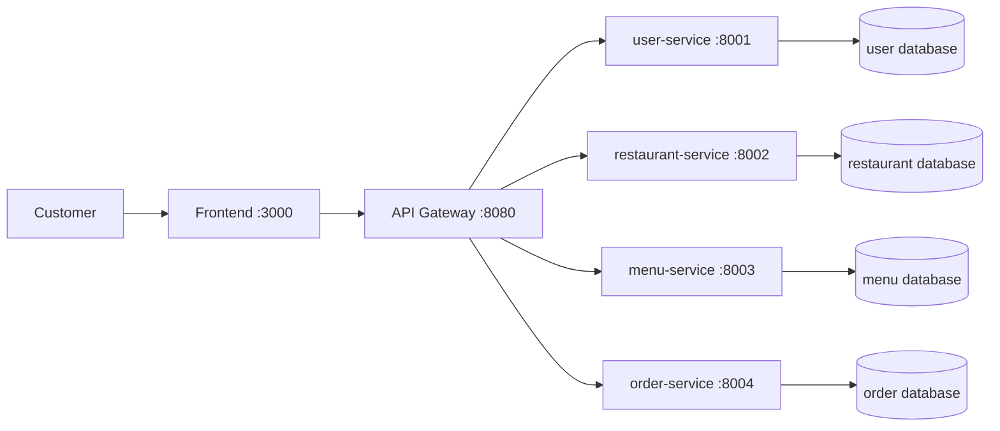

# Analysis and Design - Food Ordering Platform (SOA - Thomas Erl)

## Business Process Definition

**Domain**: Food Ordering Platform

**Business Process**: A customer browses restaurants, views menu items, and places an order.

**Actors**:

- **Customer**: Browse restaurants and menus, submit order, check order information.
- **Restaurant**: Provides restaurant profile and menu data to the platform.
- **System**: Coordinates requests and stores data across microservices.

**Scope**:

- Ordering food from restaurants.
- Managing users, restaurant data, menu items, and orders.
- Excluding payment gateway and delivery tracking optimization.

**Main Process Flow**:

1. Customer accesses frontend and sends request through API Gateway.
2. Customer retrieves restaurant list from `restaurant-service`.
3. Customer retrieves menu items from `menu-service`.
4. Customer submits order to `order-service`.
5. `order-service` validates referenced restaurant and stores order.
6. Customer can retrieve order list/details.

## Existing Automation Systems

| Existing System                   | Purpose                                  | Limitation                                          |
| --------------------------------- | ---------------------------------------- | --------------------------------------------------- |
| Manual phone ordering             | Customer calls restaurant to place order | Slow, error-prone, difficult to track order history |
| Spreadsheet-based menu management | Restaurant stores menu in local files    | Not centralized, hard to update in real-time        |
| Social media inbox ordering       | Customer sends message to order          | No structured data, difficult reporting and scaling |

## Non-Functional Requirements

| Category        | Requirement                                                                             |
| --------------- | --------------------------------------------------------------------------------------- |
| Performance     | API response time for common GET operations should be under 500 ms in local deployment. |
| Scalability     | Services are independently deployable and can be scaled separately with Docker.         |
| Availability    | Failure of one service should not stop all other services from running.                 |
| Maintainability | Each domain capability is isolated in one microservice with clear REST contracts.       |
| Security        | Basic input validation and service isolation through gateway routing.                   |
| Portability     | Full system can run using Docker Compose on any machine with Docker installed.          |

## Decompose Business Process

| Process Step               | Business Capability           | Candidate Service    |
| -------------------------- | ----------------------------- | -------------------- |
| Register or list users     | User account management       | `user-service`       |
| Browse restaurants         | Restaurant catalog management | `restaurant-service` |
| Browse menus by restaurant | Menu catalog management       | `menu-service`       |
| Create and retrieve orders | Order lifecycle management    | `order-service`      |

## Entity Service Candidates

| Entity     | Description                          | Service Candidate    |
| ---------- | ------------------------------------ | -------------------- |
| User       | Customer/manager account information | `user-service`       |
| Restaurant | Restaurant profile and metadata      | `restaurant-service` |
| MenuItem   | Dishes and prices per restaurant     | `menu-service`       |
| Order      | Customer order header information    | `order-service`      |
| OrderItem  | Line items inside an order           | `order-service`      |

## Task Service Candidate

| Task                     | Description                                     | Task Service Candidate |
| ------------------------ | ----------------------------------------------- | ---------------------- |
| Place order              | Validate references and create order with items | `order-service`        |
| View order history       | Retrieve orders filtered by user phone          | `order-service`        |
| Publish restaurant menus | Expose menus for customer browsing              | `menu-service`         |

## Identify Resources

| Service            | REST Resource  |
| ------------------ | -------------- |
| user-service       | `/users`       |
| restaurant-service | `/restaurants` |
| menu-service       | `/menus`       |
| order-service      | `/orders`      |

## Associate Capabilities with Resources

| Resource       | Capabilities                        | Methods       |
| -------------- | ----------------------------------- | ------------- |
| `/users`       | List users, create user account     | `GET`, `POST` |
| `/restaurants` | List restaurants, create restaurant | `GET`, `POST` |
| `/menus`       | List menu items, create menu item   | `GET`, `POST` |
| `/orders`      | List orders, create order           | `GET`, `POST` |

## Utility Service / Microservice Candidates

| Utility / Platform Component | Role                                                                 |
| ---------------------------- | -------------------------------------------------------------------- |
| API Gateway (Nginx)          | Single entry point, route requests from frontend to backend services |
| Frontend SPA                 | UI for customer interactions with backend through gateway            |
| Docker Compose               | Service orchestration and local deployment                           |

## Service Composition Diagram

