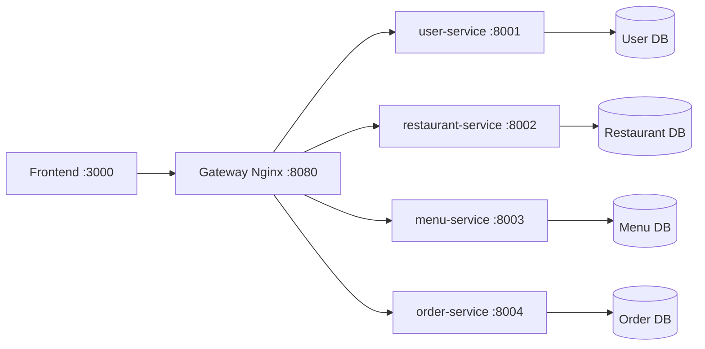

# Architecture - Food Ordering System Microservices

## Pattern Selection

| Pattern              | Selected | Note                                                                           |
| -------------------- | -------- | ------------------------------------------------------------------------------ |
| API Gateway          | YES      | Nginx is used as the single entry point for frontend requests.                 |
| Database per Service | YES      | Each microservice manages its own data store independently.                    |
| Shared Database      | NO       | Services do not directly share one database schema.                            |
| Saga                 | NO       | Current use case is simple CRUD and does not require distributed transactions. |
| Event-driven         | NO       | System currently uses synchronous REST communication.                          |
| Circuit Breaker      | OPTIONAL | Can be added later for fault tolerance on inter-service calls.                 |

## System Components

| Component          | Responsibility                                    | Technology          | Port |
| ------------------ | ------------------------------------------------- | ------------------- | ---- |
| Frontend           | Customer interface for browsing and ordering food | HTML/CSS/JavaScript | 3000 |
| Gateway (Nginx)    | Routes client requests to backend microservices   | Nginx               | 8080 |
| user-service       | Manage user data                                  | FastAPI             | 8001 |
| restaurant-service | Manage restaurant information                     | FastAPI             | 8002 |
| menu-service       | Manage menu items for restaurants                 | FastAPI             | 8003 |
| order-service      | Create and retrieve customer orders               | FastAPI             | 8004 |

## Communication Matrix

| Source             | Target              | Protocol  | Purpose                                         |
| ------------------ | ------------------- | --------- | ----------------------------------------------- |
| Frontend           | Gateway             | HTTP/REST | Send all UI API calls through a single endpoint |
| Gateway            | user-service        | HTTP/REST | Route `/users` related requests                 |
| Gateway            | restaurant-service  | HTTP/REST | Route `/restaurants` related requests           |
| Gateway            | menu-service        | HTTP/REST | Route `/menus` related requests                 |
| Gateway            | order-service       | HTTP/REST | Route `/orders` related requests                |
| user-service       | User Database       | SQL       | Persist and query user data                     |
| restaurant-service | Restaurant Database | SQL       | Persist and query restaurant data               |
| menu-service       | Menu Database       | SQL       | Persist and query menu item data                |
| order-service      | Order Database      | SQL       | Persist and query order data                    |

## Architecture Diagram

